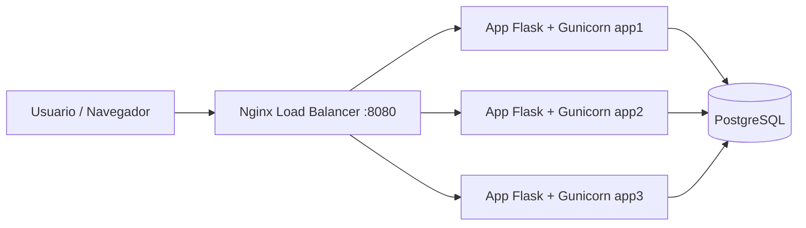

# Propuesta de arquitectura del sistema

## Objetivo

Implementar una aplicación educativa para predicciones de partidos del Mundial. El sistema permite crear salas, invitar participantes, registrar pronósticos, publicar resultados oficiales y calcular puntajes según reglas definidas.

## Componentes

## Diseño técnico

- **Frontend:** HTML, CSS y JavaScript sin framework para facilitar revisión académica.
- **Backend:** Flask con API REST.
- **Servidor de aplicación:** Gunicorn con workers y threads.
- **Base de datos:** PostgreSQL, usada como fuente única de verdad para soportar múltiples instancias.
- **Balanceador:** Nginx con estrategia `least_conn`.
- **Contenerización:** Dockerfile para la app y Docker Compose para orquestar base de datos, tres backends y balanceador.

## Escalamiento horizontal

El proyecto levanta tres instancias equivalentes del backend: `app1`, `app2` y `app3`. Todas comparten PostgreSQL, por lo que una solicitud puede ser atendida por cualquier nodo sin perder consistencia.

El endpoint `/api/health` y la tarjeta “Nodo atendiendo” muestran el hostname del contenedor que respondió. Al actualizar la página varias veces se puede evidenciar el balanceo.

## Persistencia y modelo de datos

Tablas principales:

| Tabla | Función |
|---|---|
| `rooms` | Salas o grupos creados por usuarios. |
| `participants` | Integrantes de cada sala. |
| `matches` | Partidos programados y resultados oficiales. |
| `predictions` | Pronósticos registrados por participante y partido. |

## Reglas de puntuación implementadas

- Marcador exacto: 5 puntos.
- Ganador o empate correcto sin marcador exacto: 3 puntos.
- Diferencia de goles correcta sin marcador exacto: 2 puntos, siempre que coincida el sentido del resultado.
- Racha: 2 puntos por cada bloque de 3 partidos consecutivos con ganador acertado.
- Predicción anticipada: 1 punto adicional si se registra con más de 24 horas de anticipación.
- Cierre de predicciones: la app bloquea registros durante los últimos 10 minutos antes del partido.

## Consideración sobre puntaje

Se tomó una decisión explícita para evitar doble conteo en el marcador exacto: cuando el marcador es exacto se otorgan 5 puntos y no se suman adicionalmente ganador ni diferencia. Si no es exacto, sí pueden sumarse ganador correcto y diferencia correcta.
